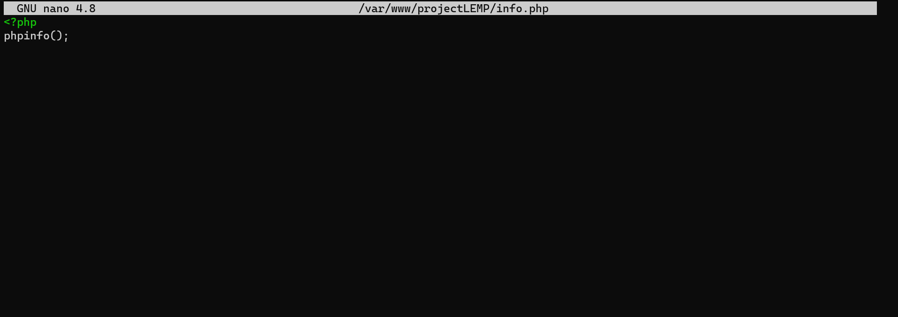

# Documentaion of Project 2
STEP 1 – INSTALLING THE NGINX WEB SERVER
- Update server package index using the command below

`sudo apt update`

Screenshot Below

- Install Nginx with the command below

`sudo apt install nginx`

Screenshot Below

- Verified that nginx was successfully installed and is running as a service in Ubuntu with the code below

`sudo systemctl status nginx`

Screenshot Below

- Access server locally using the command below

`curl http://127.0.0.1:80`
 
 Screenshot Below

- Test Nginx server's response to requests from the Internet, Paste the public IP address on the address bar of the web browser.

See screenshot below

STEP 2 — INSTALLING MYSQL

- Install Mysql using the command below

`sudo apt install mysql-server`

Screenshot below

- Install Mysql Secure using the command below

`sudo mysql_secure_installation`

Screenshot Below

- Tested if able to log into the mysql console with the command below

`sudo mysql`

Screenshot Below

- Exited the MySQL console using the command below

`mysql> exit`

STEP 3 – INSTALLING PHP

- Install php-fpm and php-mysql using the command below

`sudo apt install php-fpm php-mysql`

Screenshot Below

STEP 4 — CONFIGURING NGINX TO USE PHP PROCESSOR

- Created the root web directory for your_domain using the following commands

`sudo mkdir /var/www/projectLEMP`

Screenshot Below

- Assigned ownership of the directory with the $USER environment variable using the command below

`sudo chown -R $USER:$USER /var/www/projectLEMP`

Screenshot Below

- Opened a new configuration file in Nginx’s sites-available directory using nano editor. Typed the command below

`sudo nano /etc/nginx/sites-available/projectLEMP`

- Typed in the following bare-bones configurations

#/etc/nginx/sites-available/projectLEMP

server {
    listen 80;
    server_name projectLEMP www.projectLEMP;
    root /var/www/projectLEMP;

    index index.html index.htm index.php;

    location / {
        try_files $uri $uri/ =404;
    }

    location ~ \.php$ {
        include snippets/fastcgi-php.conf;
        fastcgi_pass unix:/var/run/php/php7.4-fpm.sock;
     }

    location ~ /\.ht {
        deny all;
    }

}

Screenshot Below

 - Saved then continued

 - Activated the configuration by linking to the config file from Nginx’s sites-enabled directory using thwse the command below

`sudo ln -s /etc/nginx/sites-available/projectLEMP /etc/nginx/sites-enabled/`
 
 - Test configuration for syntax errors using the command below

`sudo nginx -t`

Screenshot Below

- Disabled the default Nginx host that is currently configured to listen on port 80 using the command below

`sudo unlink /etc/nginx/sites-enabled/default`

- Reload Nginx to apply the changes using the command below

`sudo systemctl reload nginx`

Screenshot Below

- Results from the web browser after entering the public IP address

Screenshot Below

STEP 5 – TESTING PHP WITH NGINX

 Tested to validate that Nginx can correctly hand php files off to PHP processor by creating a test PHP file in document root

 - Opened a new file called info.php within document root in nano editor using the code below

`sudo nano /var/www/projectLEMP/info.php`

- Typed the below into newly created file

 `<?php
phpinfo();`

Screenshot Below

- Results from the web browser

Screenshot Below

Removed file containing sensitive info about PHP environment using the command below

`sudo rm /var/www/your_domain/info.php`

STEP 6 – RETRIEVING DATA FROM MYSQL DATABASE WITH PHP

- Connected to the MySQL console using the root account with the command below

`sudo mysql`

- Created a new database using the command from MySQL console

`mysql> CREATE DATABASE `example_database`;`

- Created a new user and granted full privileges using the command below

`mysql>  CREATE USER 'example_user'@'%' IDENTIFIED WITH mysql_native_password BY 'password';`

- Gave user permission over the example_database database using the command below

`mysql> GRANT ALL ON example_database.* TO 'example_user'@'%';`

Screenshot Below

Exited the MySQL shell using the command below 

`mysql> exit`

Tested if user has the proper permissions using the command below

`mysql -u example_user -p`

- Confirmed user access to the example_database database using the command below

`mysql> SHOW DATABASES;`

Screenshot Below

- Created a test table named todo_list using the command below from the MySQL console

`CREATE TABLE example_database.todo_list (
mysql>     item_id INT AUTO_INCREMENT,
mysql>     content VARCHAR(255),
mysql>     PRIMARY KEY(item_id)
mysql> );`

- Inserted a few rows of content in the test table using the command below

`mysql> INSERT INTO example_database.todo_list (content) VALUES ("My first important item");`

- Confirmed that the data was successfully saved to the table using the command below

`mysql>  SELECT * FROM example_database.todo_list;`

Screenshot Below

Exited the Mysql console using the command below

`mysql> exit`

- Created a new PHP file in custom web root directory using vi editor

`nano /var/www/projectLEMP/todo_list.php`

- Typed the below content into your todo_list.php script:

`<?php
$user = "example_user";
$password = "password";
$database = "example_database";
$table = "todo_list";

try {
  $db = new PDO("mysql:host=localhost;dbname=$database", $user, $password);
  echo "<h2>TODO</h2><ol>";
  foreach($db->query("SELECT content FROM $table") as $row) {
    echo "<li>" . $row['content'] . "</li>";
  }
  echo "</ol>";
} catch (PDOException $e) {
    print "Error!: " . $e->getMessage() . " ";
    die();
}`

Screenshot Below

Saved then exited

- Results form the web browser

Screenshot Below

 

